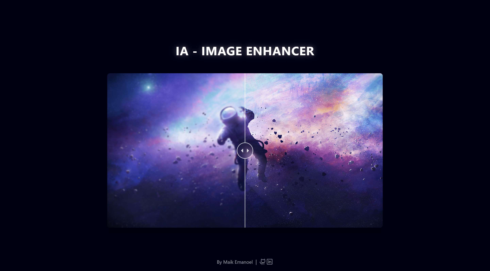

<h1 align="center"> IA - Image Enhancer | BoraCodar#29 </h1>

[Clique aqui para acessar](https://image-enhancer-maik-emanoel.vercel.app/)

## 🚀 Tecnologias

Esse projeto foi desenvolvido com as seguintes tecnologias:

- [React.js](https://react.dev/)
- [Tailwind CSS](https://tailwindcss.com/)
- [ReactCompareSlider (Biblioteca)](https://react-compare-slider.vercel.app/?path=/story/docs-intro--page)
- Git and GitHub

## 💻 Projeto

O projeto "IA - Image Enhancer" simula a interface de uma plataforma de melhoria de imagem feita por IA (Inteligência Artificial).  

Projeto construído a partir do layout proposto no desafio [#BoraCodar29](https://boracodar.dev/) realizado pela [Rocketseat](https://rocketseat.com.br).
Após o desenvolvimento do projeto inicial, adicionei novas features, tais quais:

- Layout responsivo (Adaptado para telas menores);
- Remodelação do layout proposto;
- Efeitos hover;
- Animação de carregamento/entrada;
- Adição do comportamento de arrastar;
- Entre outras pequenas modificações.

## 🔖 Layout

Você pode visualizar o layout do projeto proposto através [DESSE LINK](https://www.figma.com/community/file/1263495196524106760). É necessário ter conta no [Figma](https://figma.com) para acessá-lo.